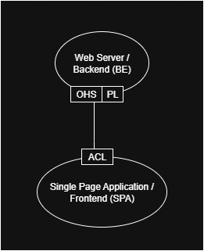

<a href="https://github.com/andres81/The-Self-Actualization-Project">The
Self-Actualization Project Documentation</a> © 2025
by <a href="https://www.andreschepers.nl">André Schepers</a> is licensed
under <a href="https://creativecommons.org/licenses/by/4.0/">CC BY
4.0</a>

# The Self-Actualization Project Software Component

## Table of Contents

* Introduction
* Software Design
* Documentation Structure
* Book references

## Introduction

This project is being developed using
[Unified process](https://en.wikipedia.org/wiki/Unified_process) (UP),
[Domain-driven design](https://en.wikipedia.org/wiki/Domain-driven_design)
(DDD) and
[Systems engineering](https://en.wikipedia.org/wiki/Systems_engineering)
([MIT](https://learn-xpro.mit.edu/systems-engineering)).
From the systems engineering domain, also
the [Object Process Methodology](https://en.wikipedia.org/wiki/Object_Process_Methodology)
is used.

The software will consist of two parts: An application run in the users
browser and an application connected to the internet that serves as the
information provider of the browser application. The benefits are among so
many others, of course:

* Availability:
    * Mobile phones
    * Laptop devices
    * Internet access is available everywhere these days
* Central storage point
* Ease of sharing content

Using Domain Driven Design (DDD) to visualize this setup, we first discern two
subdomains:

* The frontend, the application running in the browser
* The backend, the application running standalone and connected to the internet

The idea is that the base implementation of the Single Page Application (SPA)
that is the frontend, and the webserver with API, will implement all the basic
needs like authentication/authorization, security, database connectivity,
logging, etc... Any module, that is a tool in itself, for example the dialogue
trainer can be easily added then to the software component, while it will
itself remain light and easy to implement.

## Software Design

Following UP, use cases will be described first in the process of creating this
software. In parallel, domain rules will be written down as well as the vision
of
this project.

For the software design, several methodologies are used:

* [Unified Process](https://en.wikipedia.org/wiki/Unified_process) (UP)
* [Domain-Driven Design](https://en.wikipedia.org/wiki/Domain-driven_design)
  (DDD)
* [Systems engineering](https://en.wikipedia.org/wiki/Systems_engineering)
  MIT [style](https://learn-xpro.mit.edu/systems-engineering) using
  [Object Process Methodology](https://en.wikipedia.org/wiki/Object_Process_Methodology)
* [Hexagonal Application Architecture](https://alistair.cockburn.us/hexagonal-architecture)

Following UP, use cases will be described first in the process of creating this
software. In parallel, domain rules will be written down as well as the vision
of
this project.

    Agile Scrum is not a software development methodology in itself,
    as it is more of a project management tool instead, in the authors opinion.
    Unfortunately, the experience of the author learns that many people actually
    believe Scrum in itself gets you high quality software. Combine that with
    software programmers posing / presenting themselves as software engineers,
    while knowing nothing about software design, and you end up in the situation
    of poor software maintenance / evolution.
    ( The author considers himself merely a student at this point in his career
    of software engineering )

## Documentation Structure

The structure of the documentation consists of separate directories, each with a
README.md for a quick introduction to the context of the documentation within
that directory, and subject specific Markdown files.

Following **UP**, the following artifacts are chosen:

* Use case descriptions
* Domain rules document
* Supplementary Specification document
* Vision document
* Glossary

The use cases can be found in the directory __*use-cases*__. The other artifacts
in the directory __*UP-artifacts*__.

## Book references

| Title                                                                                                                                                                                                                                               | Subjects covered                                                                                                                                          |
|-----------------------------------------------------------------------------------------------------------------------------------------------------------------------------------------------------------------------------------------------------|-----------------------------------------------------------------------------------------------------------------------------------------------------------|
| [Applying UML and Patterns](https://www.craiglarman.com/wiki/index.php?title=Book_Applying_UML_and_Patterns)                                                                                                                                        | [Unified Process](https://en.wikipedia.org/wiki/Unified_process) [Unified Modeling Language](https://en.wikipedia.org/wiki/Unified_Modeling_Language) |
| [Implementing Domain-Driven Design](https://vaughnvernon.com/)                                                                                                                                                                                      | [Domain-driven design](https://en.wikipedia.org/wiki/Domain-driven_design)                                                                                |
| [Get Your Hands Dirty on Clean Architecture: Build ‘clean' applications with code examples in Java](https://www.packtpub.com/en-us/product/get-your-hands-dirty-on-clean-architecture-9781839212710)                                                | [Hexagonal / Clean Application Architecture](https://alistair.cockburn.us/hexagonal-architecture)                                                         |
| [Designing Hexagonal Architecture with Java: An architect's guide to building maintainable and change-tolerant applications with Java and Quarkus](https://www.packtpub.com/en-us/product/designing-hexagonal-architecture-with-java-9781801810296) | [Hexagonal / Clean Application Architecture](https://alistair.cockburn.us/hexagonal-architecture)                                                         |
| [Unifying User Stories, Use Cases, Story Maps](https://alistaircockburn.com/Everything-else)                                                                                                                                                        | [Use Cases](https://en.wikipedia.org/wiki/Use_case)                                                                                                       |
| [Writing Effective Use Cases](https://alistaircockburn.com/Books)                                                                                                                                                                                   | [Use Cases](https://en.wikipedia.org/wiki/Use_case)                                                                                                       |
