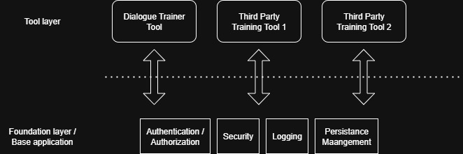

<a href="https://github.com/andres81/The-Self-Actualization-Project">The
Self-Actualization Project Documentation</a> © 2025
by <a href="https://www.andreschepers.nl">André Schepers</a> is licensed
under <a href="https://creativecommons.org/licenses/by/4.0/">CC BY
4.0</a>

# The Self-Actualization Project Software (SAPS) Vision

Work in progress...

The idea of a software component in the context of the self-actualization
project, is to provide software tools to an individual. Wherever, whenever,
being able to work on ones self-actualization offers opportunities for people
before unimaginable:

* Getting to a better position in society
* Spending less money on education (education being a prerequisite of
  self-actualization)
* Using one's time most optimal
* Less traveling

With modern-day technology, therefore, it makes sense to then use a combination
of two types of software:

* Software running in web browsers using the so-called [Single Page Application
  (SPA)](https://en.wikipedia.org/wiki/Single-page_application).
* Software running on the internet:
  A [web server](https://en.wikipedia.org/wiki/Web_server) with
  a [web API](https://en.wikipedia.org/wiki/Web_API).

Furthermore, the software consists of two layers:

* The foundation: Offering basic functionality like security and central user
  management and admin functionality.
* Software modules that each offer a set of functionalities on their own. For
  example, the Dialogue Trainer Tool.

The software modules can be developed by third parties. The foundation layer
offers an API to the developers that can be used to make use of the offered
functionalities. An example is the injected user id in REST endpoint
controllers.

All the functionality, offered to users in the context of self-actualization,
therefore comes from the software modules, not the foundation layer directly.

Login functionality is completely delegated to third party OAuth2 providers like
Google and Facebook. Their OAuth2 login flows provide a subject identifier,
uniquely identifying a user within the context of their systems. This identifier
is then used within the SAPS application as a starting point of user creation
and subsequently as user identification after login through one of the third
parties.

