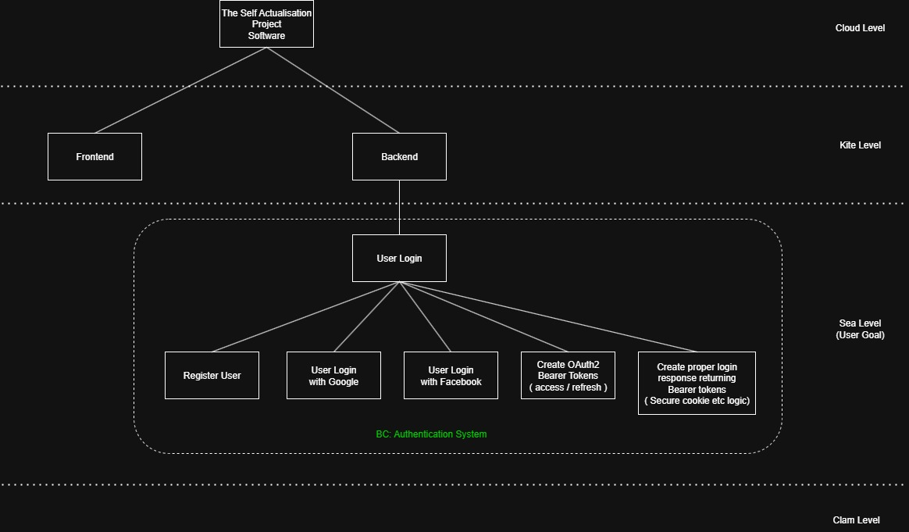

<a href="https://github.com/andres81/The-Self-Actualization-Project">The
Self-Actualization Project Documentation</a> © 2025
by <a href="https://www.andreschepers.nl">André Schepers</a> is licensed
under <a href="https://creativecommons.org/licenses/by/4.0/">CC BY
4.0</a>

# The Self-Actualization Project Software Use Cases

This document will give an overview of use cases implemented by this software
component. The use cases will be given in brief format. Dedicated files are
given for fully dressed format use cases.

## Use Cases

### Goal Level Diagram

### UC1 - User login

Given a subject id, a user is retrieved from the database. If user is not found,
the user is created by __*UC2 - User registration*__.
After the user is retrieved, a pair of access and refresh tokens are created.
The access token contains the authorization claims (roles/scopes). The tokens
are returned in the response to the client.

### UC2 - User registration

Given a subject id, a new user account is created and persisted in the database.
The unique identifier of the user account is returned.

### UC3 - Exchange refresh token for a new access token

Given a refresh token, a new access token and refresh token are created and
returned. The refresh token is thoroughly checked or otherwise the process is
cancelled.

### UC4 - Logout

Logout consists of removing the refresh token stored with which the user could
refresh the access token. This does imply it might take a while before access is
completely withdrawn from all devices as the access tokens have an expiry time
(one hour for example).

### UC5 - Google Authentication

Google login consists of a user authenticating with Google, after which Google
will send the
[Google ID token](https://developers.google.com/identity/gsi/web/guides/verify-google-id-token)
back. The backend Google Login starts upon receiving the Google ID token. This
token contains the subject id that uniquely identifies the user to Google. As
the Google docs recommend, this subject id is used to uniquely identify the user
within this project for Google logins.

