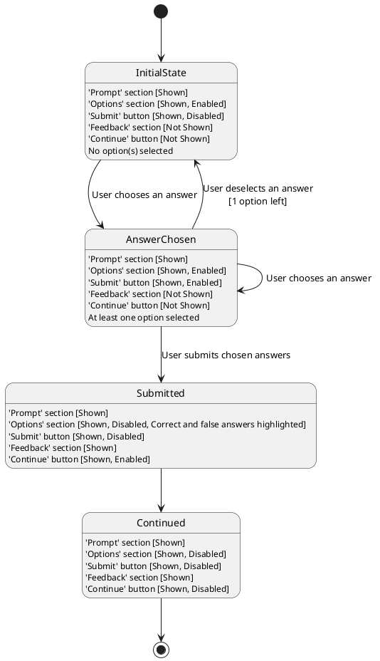

# Item Renderer Functional Architecture

## Introduction

## Composit Structure Diagram

Click me

## State Diagram

Click me

```plantuml
@startuml

[*] --> InitialState
InitialState : 'Prompt' section [Shown]
InitialState : 'Options' section [Shown, Enabled]
InitialState : 'Submit' button [Shown, Disabled]
InitialState : 'Feedback' section [Not Shown]
InitialState : 'Continue' button [Not Shown]
InitialState : No option(s) selected
InitialState --> AnswerChosen : User chooses an answer
AnswerChosen --> AnswerChosen : User chooses an answer
AnswerChosen --> InitialState : User deselects an answer\n[1 option left]
AnswerChosen --> Submitted : User submits chosen answers
AnswerChosen : 'Prompt' section [Shown]
AnswerChosen : 'Options' section [Shown, Enabled]
AnswerChosen : 'Submit' button [Shown, Enabled]
AnswerChosen : 'Feedback' section [Not Shown]
AnswerChosen : 'Continue' button [Not Shown]
AnswerChosen : At least one option selected
Submitted --> Continued
Submitted : 'Prompt' section [Shown]
Submitted : 'Options' section [Shown, Disabled, Correct and false answers highlighted]
Submitted : 'Submit' button [Shown, Disabled]
Submitted : 'Feedback' section [Shown]
Submitted : 'Continue' button [Shown, Enabled]
Continued --> [*]
Continued : 'Prompt' section [Shown]
Continued : 'Options' section [Shown, Disabled]
Continued : 'Submit' button [Shown, Disabled]
Continued : 'Feedback' section [Shown]
Continued : 'Continue' button [Shown, Disabled]

@enduml

```

